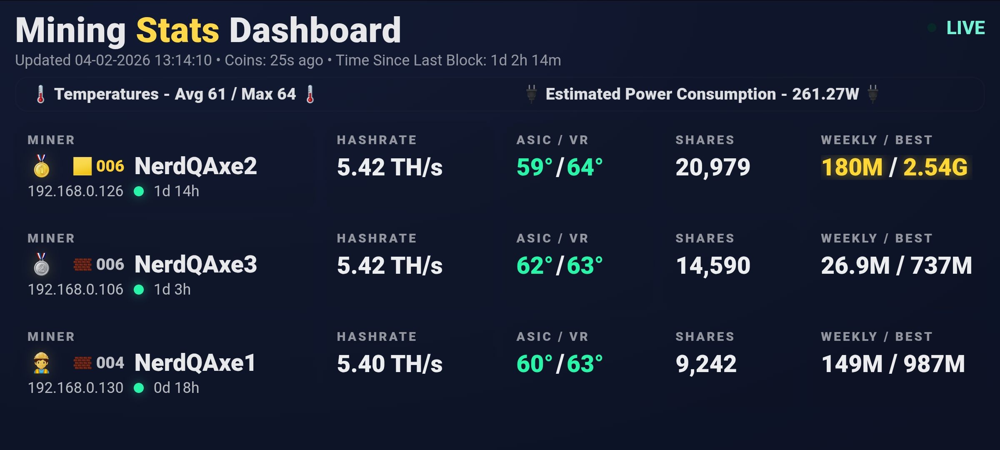
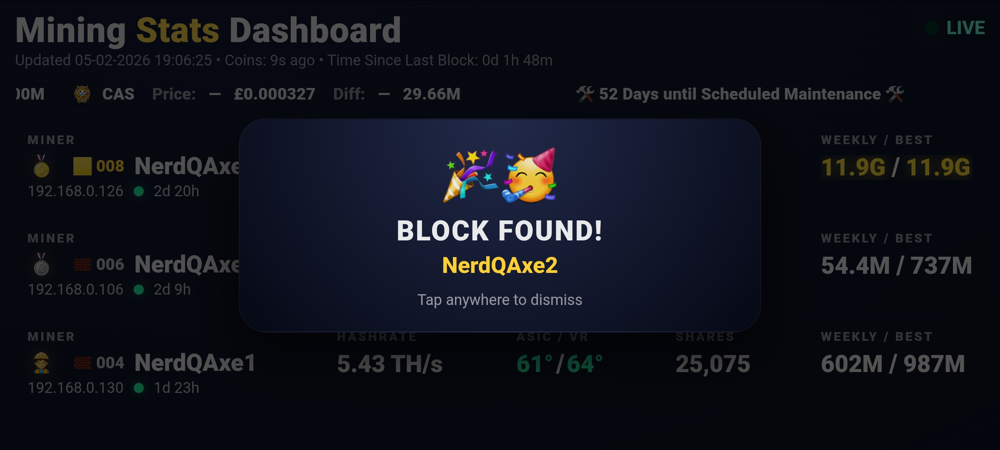

# Mining Stats Dashboard (v1.0.2)





A lightweight, self-hosted mining dashboard for NerdQAxe and BitAxe Gamma miners.

This project polls miner APIs on your local network, tracks hashrate, temperatures,
shares, blocks found, weekly performance, and displays everything in a clean,
single-page web dashboard with a scrolling coin & stats ticker.

Designed to be:

- Easy to deploy  
- Hard to break  
- Safe by default  
- Fully local (LAN-first)

---

## ⚠️ Disclaimer

This software is provided **as-is**, without warranty of any kind.

You use this software **entirely at your own risk**.  
The author is **not responsible** for:

- Hardware damage  
- Misconfiguration  
- Lost profits or rewards  
- Downtime  
- Data loss  
- Incorrect statistics  
- Financial decisions made based on this dashboard  

This dashboard is for **informational purposes only** and does **not** constitute
financial or investment advice.

**Do not expose this service directly to the public internet** unless you fully
understand and accept the security implications.

---

## ✨ Features

- Live miner monitoring (LAN)  
- Hashrate, temperature, shares, uptime tracking  
- Block found detection (including BitAxe Gamma `blockFound` API)  
- Persistent block counts across restarts  
- Weekly best difficulty tracking  
- Miner of the Week scoring and highlight  
- Coin price + difficulty ticker (BTC / BCH / FB / DGB)  
- Ticker also shows total hashrate, temps, miner counts & total blocks  
- Block popup overlay when a miner finds a block  
- Auto Sunday-night weekly rollover (resets weekly stats, computes winners, restarts miners)  
- Discord webhook notifications for block found events  
- Fully self-contained single Python file (`ticker.py`)  
- No database required  

---

## 🆕 Changes in v1.0.1 (compared to the original V1)

**Stats & logic**

- Added **reset-safe weekly best difficulty** tracking:
  - Weekly best per miner is stored separately from the miner’s own session counter.
  - Survives miner restarts and counter resets.
- Implemented **Miner of the Week (MOTW)**:
  - Score based on blocks, difficulty, hashrate vs baseline, shares/hr vs baseline, and uptime.
  - Winner & summary persisted and shown in the ticker.
- Added **weekly rollover logic** (Sunday 23:59 server time):
  - Computes previous week’s *best difficulty* and *Miner of the Week*.
  - Saves results to JSON.
  - Resets weekly baselines and weekly bests.
  - Attempts to restart all configured miners via their `/api/system/restart` endpoint.
- Improved **block tracking**:
  - Uses miner-reported `blockFound`/`blocksFound` (or similar) as a reset-safe counter.
  - Handles decreases as resets instead of losing the total.
  - Persists counts and timestamps to `blocks.json`.

**UI & layout**

- Miner list now:
  - Sorts primarily by **blocks**, then **best overall diff**, then name.
  - Highlights the **block leader** with a different block icon and gold text.
  - Shows **Miner of the Week** with a glowing gold name.
  - Uses **paging** with `MINERS_PER_PAGE` and `MINER_PAGE_SECONDS` rotation.
- “Weekly / Best” column:
  - Weekly best difficulty is **highlighted** for the current top miner.
  - Best overall difficulty is **highlighted** for the global top miner.
- **Block popup overlay**:
  - When a miner’s block count increases, a full-screen popup appears with the miner name and celebration emojis.
- **ASIC / VR / FAN** row:
  - ASIC and VR temps still colour-coded (green/orange/red based on thresholds).
  - **Fan speed is now rendered in plain white text** for easier reading.

**Shares section**

- Reworked the shares panel:
  - Card label changed to: **`SHARES REJECTED`**.
  - Content now shows:  
    `rejected_count / rejected_percentage`
  - `rejected_percentage` is computed from raw `accepted` + `rejected` shares:
    - `rejected % = rejected / (accepted + rejected) * 100`
    - 2 decimal places under 10%, 1 decimal place otherwise.
  - If data is missing or invalid, it falls back to `- / -`.

**Ticker upgrades**

- Ticker shows for each coin:
  - Price in GBP and its direction indicator (up / down / flat).
  - Difficulty and its direction indicator.
  - Coin logos via CoinGecko, with fallback URLs.
- Extra ticker items:
  - **Miner of the Week** summary line.
  - **Previous week best difficulty** summary line.
  - Global stats:
    - Total blocks found  
    - Active miners vs total miners  
    - Total hashrate (TH/s)  
    - Average and max temperatures across all miners  

**File / script changes**

- Main script is now **`ticker.py`**, not `MSD.py`.  
- Uses JSON files in the same directory for persistence:
  - `blocks.json` / `blocks.json.bak`  
  - `weekly_best.json` / `weekly_best.json.bak`  
  - `weekly_current.json` / `weekly_current.json.bak`  
  - `miner_of_week.json` / `miner_of_week.json.bak`  

## What’s new in v1.0.2

- Configurable fiat currency (code + symbol) for all coin prices.
- Configurable temperature thresholds for the colour indicators.
- Cleaner, generic “Pool: host:port” mining display (not tied to any specific coin).
- New ticker items for total hashrate, total estimated power, efficiency and temperatures.
- Maintenance countdown in the ticker based on `MAINTENANCE_CYCLE_DAYS`.
- Miner of the Week summary line, calculated from blocks, difficulty, hashrate, shares and uptime.
- Block-found popup overlay when any miner’s block count increases.
- Displays correctly on PC/Laptop Browsers to show more Miners


---

## 🧱 Supported Miners

Tested with:

- NerdQAxe (NerdOS)  
- BitAxe Gamma (AxeOS)  

Other miners may work if they expose similar `/api/system/info` JSON fields, including:

- Hashrate  
- Temps  
- Shares accepted / rejected  
- Optional block counter (`blockFound`, `blocksFound`, `blocks`, etc.)

---

## 🚀 Quick Start

### 1. Install dependencies

From the project directory:

```bash
python3 -m pip install -r requirements.txt
``` 
2. Configure the dashboard

## Configuration

Edit the **CONFIG SECTION** at the top of `MSD.py`:

```python
# Polling
REFRESH_SECONDS = 5            # How often to poll miners
COIN_REFRESH_SECONDS = 30      # How often to refresh prices/difficulty

# Stale data thresholds
STALE_YELLOW_SECONDS = 20
STALE_RED_SECONDS = 60

# Temperature thresholds (colour changes)
TEMP_ORANGE_AT = 67
TEMP_RED_AT = 70

# Currency
CURRENCY_CODE = "GBP"          # e.g. "GBP", "USD", "EUR"
CURRENCY_SYMBOL = "£"          # e.g. "£", "$", "€"

# Maintenance countdown (for ticker text only)
MAINTENANCE_CYCLE_DAYS = 56    # e.g. 8-week cycle

# Miner definitions
MINERS = {
    "Miner1": {"ip": "192.168.0.130", "label": "Miner1", "model": "Nerd"},
    "Miner2": {"ip": "192.168.0.126", "label": "Miner2", "model": "Nerd"},
    "Miner3": {"ip": "192.168.0.106", "label": "Miner3", "model": "Nerd"},
    "Miner4": {"ip": "192.168.0.191", "label": "Miner4", "model": "Gamma"},
}

3. Run the dashboard

From the project directory:
```bash
python3 ticker.py
```

Then open your browser and go to:

```bash
http://<server-ip>:8788
```

Replace <server-ip> with the IP address of the machine running ticker.py.
For example, if it’s your Pi: http://192.168.0.147:8788

🪨 Troubleshooting: Blocks stuck at 0

This dashboard increments Blocks when your miner exposes a block counter
in /api/system/info (often blockFound, blocksFound, or similar).

On some NerdOS / AxeOS builds, you may need to:

Enable “Block Found Alerts” (or similar) in the miner UI

Make sure you’re running a firmware that exposes the block counter in the API

If your miner does not expose a block counter, Blocks will remain 0.

💖 Support

This project is free and open source.
If it’s helped you keep your farm happy, you can optionally send a donation:

BTC: bc1qdtn0pwvr9yl7gyfz9l2w874l3jflcgcqxd2yry

