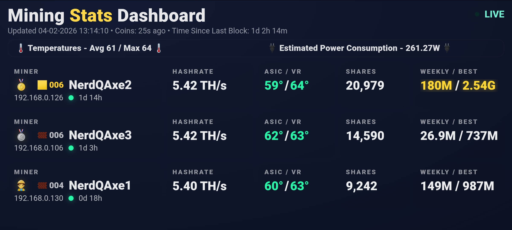
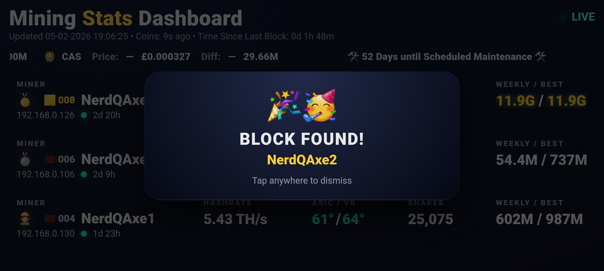

# Mining Stats Dashboard (Public v1.0.3)





A lightweight, self-hosted dashboard for NerdQAxe (NerdOS) and BitAxe Gamma (AxeOS) miners.

It polls your miners over your local network (LAN), tracks performance stats (hashrate, temps, shares, uptime, blocks), keeps weekly records, and serves a clean single-page web UI with a scrolling coin + stats ticker.

Design goals:

✅ Easy to deploy

✅ Hard to break

✅ Safe by default

✅ LAN-first (no cloud, no accounts)

---

## ⚠️ Disclaimer

This software is provided as-is, without warranty of any kind.

You use this software entirely at your own risk. The author is not responsible for:

- Hardware damage
- Misconfiguration
- Lost profits / rewards
- Downtime
- Data loss
- Incorrect statistics
- Financial decisions made using this dashboard

This dashboard is for informational purposes only and does not constitute financial or investment advice.

Do not expose this service to the public internet unless you fully understand the security implications.

---

## ✨ Features (Public v1.0.3)
Miner monitoring
- Live miner monitoring on your LAN
- Hashrate (TH/s), uptime, temps (ASIC/VR), fan %, shares accepted/rejected
- Stale/offline detection with configurable thresholds
- Optional temperature unit display (C/F)
- Power + efficiency support (when miner API provides it)

Blocks + weekly stats
- Block-found detection using miner-reported counters (blockFound / blocksFound / similar)
- Persistent block counts across restarts (JSON persistence)
- Weekly best difficulty tracking (reset-safe)
- “Miner of the Week” scoring + highlight in ticker
- Auto weekly rollover (Sunday night): saves results, resets weekly stats, and optionally restarts miners

Ticker + UI
- Coin ticker with price + difficulty + direction indicators
- Extra ticker items for total hashrate, temps, active miners, total blocks
- Maintenance countdown ticker item (MAINTENANCE_CYCLE_DAYS)
- Coin logos (CoinGecko) with fallbacks
- Block-found popup overlay
- Clean single-file web UI served directly from the Python script

Alerts
- Discord webhook notifications for block found events---

## 🧱 Supported Miners

Tested with:
- NerdQAxe (NerdOS)
- BitAxe Gamma (AxeOS)

Other miners may work if they expose similar fields via:
- http://<miner-ip>/api/system/info

Helpful fields include:
- Hashrate
- Temps
- Shares accepted/rejected
- Optional block counter (blockFound, blocksFound, blocks, etc.)

---

## 🚀 Quick Start

1. Install dependencies

From the project directory:

```bash
python3 -m pip install -r requirements.txt
``` 
2. Configure the dashboard

## Configuration

Open MSD.py and edit the CONFIG SECTION at the top.
Everything is safe-by-default: leaving values blank disables optional features.

Example config:

```python
# Web server
HOST = "0.0.0.0"
PORT = 8788

# Polling
REFRESH_SECONDS = 5
COIN_REFRESH_SECONDS = 30

# Stale data thresholds
STALE_YELLOW_SECONDS = 20
STALE_RED_SECONDS = 60

# Temperature thresholds (colour changes)
TEMP_ORANGE_AT = 67
TEMP_RED_AT = 70
TEMP_UNIT = "C"  # or "F"

# Currency
FIAT_CURRENCY = "GBP"
FIAT_SYMBOL = "£"

# Maintenance countdown (optional)
MAINTENANCE_CYCLE_DAYS = 56  # 8-week cycle

# Discord webhook (optional)
DISCORD_WEBHOOK_URL = ""  # leave blank to disable

# Miners (optional — dashboard still runs if empty)
MINERS = {
    "Miner1": {"ip": "192.168.0.130", "label": "Nerd1",  "model": "Nerd"},
    "Miner2": {"ip": "192.168.0.191", "label": "Gamma1", "model": "Gamma"},
}
Tips:
- label is just what you want displayed (optional).
- model is used for baseline comparisons (e.g. MOTW scoring). Unknown models still work.

---

## ⚙️ Configuration guide (Public v1.0.3)
Polling intervals
- REFRESH_SECONDS — how often miner stats are polled
- COIN_REFRESH_SECONDS — how often coin price/difficulty refreshes

Stale thresholds
- STALE_YELLOW_SECONDS — miner considered “stale” (yellow) after this many seconds
- STALE_RED_SECONDS — miner considered “stale” (red) after this many seconds

Temperature display
- TEMP_ORANGE_AT, TEMP_RED_AT — colour thresholds
- TEMP_UNIT — "C" or "F"

Currency
- FIAT_CURRENCY — "GBP", "USD", "EUR", etc
- FIAT_SYMBOL — £, $, €, etc

Maintenance countdown
- MAINTENANCE_CYCLE_DAYS — used only for a ticker reminder like “Maintenance in X days”

Miners list

Add your miners in:
```bash
MINERS = {
  "Miner1": {"ip": "192.168.0.130", "label": "Miner1", "model": "Nerd"},
  "Miner2": {"ip": "192.168.0.191", "label": "Miner2", "model": "Gamma"},
}
``` 
- ip is required
- label is optional (falls back to hostname or the dictionary key)
- model should match your baseline config keys (e.g. "Nerd", "Gamma")


Baselines (optional)

Used for “Miner of the Week” scoring:
```bash
MODEL_BASELINES = {
  "Nerd":  {"baseline_ths": 5.50, "baseline_shares_per_hour": 40.0},
  "Gamma": {"baseline_ths": 1.25, "baseline_shares_per_hour": 10.0},
}
``` 
If you don’t care about MOTW accuracy, you can leave these as defaults.

⛏️ Mining display: custom “Mining DGB / XEC / QUAI / anything”

The dashboard tries to infer what a miner is mining from its stratum host/port/user.
Since pool formats vary wildly, Public v1.0.3 includes an optional rule system so you can force the mining label reliably.

✅ Custom mining rules (recommended for “Mining DGB” setups)

In the CONFIG SECTION, add:
```bash
CUSTOM_MINING_RULES = [
  {"host_contains": "solo.solohash.co.uk", "port": None, "coin": "DGB"},
  {"host_contains": "mining.example.com",  "port": 5555, "coin": "XEC"},
  {"host_contains": "mining.example.com",  "port": 6666, "coin": "DGB"},
]
``` 
How it works:

- host_contains → matches if the stratum host contains this text (case-insensitive)
- port → optional
- number (e.g. 3333) matches only that port

None matches any port
- coin → what to display (e.g. "DGB")

✅ If a rule matches, the miner shows: Mining DGB (and the logo if available).
✅ If nothing matches (or the miner doesn’t report stratum info), it falls back to showing the miner IP so the UI is always readable.

⚠️ Important note about “universal” pool endpoints (multi-coin)

Some pools use the same host + port for multiple coins, and the coin is chosen by worker settings or server-side routing.
In that situation, the dashboard cannot automatically know which coin is being mined because the endpoint doesn’t uniquely identify it.

✅ Fix: use CUSTOM_MINING_RULES (or accept the fallback display).
❌ Not possible: “automatic detection” when the pool itself doesn’t provide a coin-specific identifier.

3. Run the dashboard

From the project directory:
```bash
python3 MSD.py
```

Then open your browser and go to:

```bash
http://<server-ip>:8788
```

Replace <server-ip> with the IP address of the machine running MSD.py.
For example, if it’s your Pi: http://192.168.0.147:8788

🪨 Troubleshooting: 
Miners show “offline”

Check the miner IP address is correct

Make sure the miner API is reachable on your LAN:

http://<miner-ip>/api/system/info

Some networks isolate Wi-Fi clients (AP isolation). Disable that if needed.

Blocks stay at 0

Blocks only increment if your miner exposes a block counter field in its API output (commonly blockFound, blocksFound, blocks, etc.).

If your miner firmware doesn’t provide that field, the dashboard can’t infer blocks — so it will remain 0.

Coins / logos not updating

Coin price + difficulty data relies on external public endpoints (e.g., CoinGecko / WhatToMine). If those rate-limit or change, the dashboard will keep running but may show - temporarily.

📁 Files created by the dashboard

The dashboard stores small JSON files alongside MSD.py to persist totals and weekly stats:

blocks.json (and .bak)

weekly_best.json (and .bak)

weekly_current.json (and .bak)

miner_of_week.json (and .bak)

maintenance.json (and .bak)

notifications.json (and .bak)

They’re safe to delete if you want a clean reset (you’ll lose history).

💖 Support

This project is free and open source.
If it’s helped you keep your farm happy, you can optionally send a donation:

BTC: bc1qdtn0pwvr9yl7gyfz9l2w874l3jflcgcqxd2yry
